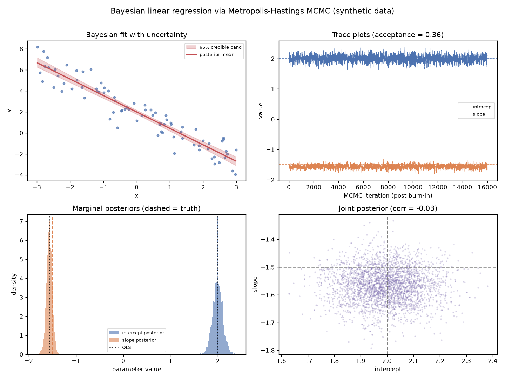

# Metropolis-Hastings MCMC

A least-squares fit gives you one line and a false sense of certainty. Bayesian inference gives you a *distribution* over every plausible line — honest uncertainty you can quote. For all but the simplest models that distribution has no formula, so you sample it with Markov-chain Monte Carlo. This project builds the Metropolis-Hastings sampler from scratch and uses it to fit a Bayesian linear regression.

## Demo Output



Produced entirely from synthetic data by `demo.py` — no downloads. The sampler recovers the true parameters and, crucially, their uncertainty.

## Why This Exists

Bayesian statistics wants the *posterior*: the probability distribution of your parameters given the data. Multiply likelihood by prior and you have it — up to an intractable normalising constant that you cannot compute for most models. MCMC is the escape hatch. It builds a random walk through parameter space that visits each region in proportion to its posterior probability, so the histogram of the walk *is* the posterior, normalising constant and all. Metropolis-Hastings is the simplest such walk: propose a nearby move, and accept it with a probability that depends only on the ratio of posteriors — which makes the pesky constant cancel. This one trick underlies Stan, PyMC, JAGS, and modern Bayesian phylogenetics.

## How It Works

1. **Write the log-posterior.** Log-likelihood (Gaussian errors) plus log-prior on the intercept, slope, and noise scale.
2. **Walk.** From the current parameters, propose a Gaussian random step; accept with probability min(1, posterior ratio); record where you are.
3. **Discard burn-in and summarise.** The remaining samples approximate the posterior — take means for point estimates and percentiles for credible intervals.

The demo shows four essential MCMC diagnostics and outputs:

1. **The fit with uncertainty** — the posterior-mean regression line *and* a 95% credible band built from posterior draws, not a single line.
2. **Trace plots** — the chains for intercept and slope, which should look like fuzzy caterpillars hovering around the truth (good mixing).
3. **Marginal posteriors** — histograms of each parameter, with the true value and the ordinary-least-squares estimate overlaid for validation.
4. **The joint posterior** — intercept against slope, revealing the correlation between parameters that a point estimate completely hides.

## When NOT to Use This

Random-walk Metropolis is easy to understand and slow to converge; in high dimensions or with strongly correlated parameters it mixes terribly, and you should reach for Hamiltonian Monte Carlo / NUTS (as in Stan/PyMC). MCMC also demands vigilance: a chain that has not converged produces confident nonsense, so trace plots, multiple chains, and convergence statistics are not optional. And if a conjugate closed-form posterior exists, use it — MCMC is for when it does not.

## The Uncomfortable Truth

A single fitted line is a decision dressed up as a fact. The data almost always support a *range* of lines, and pretending otherwise is how overconfident conclusions get published. MCMC forces you to look at that range — the credible band, the joint posterior — and it will often be wider than you hoped. That discomfort is the point: it is the uncertainty that was always there, finally made visible.

## Run It

```bash
pip install -r requirements.txt
python demo.py
```

`mcmc.py` provides `make_log_posterior` and a general `metropolis` sampler reusable on any log-posterior.

## Further Reading

Inspired by the Bayesian and MCMC material in *Modern Statistics for Modern Biology* (Holmes & Huber, https://www.huber.embl.de/msmb/).

> Demonstrated on synthetic data, so the whole thing is reproducible with no external downloads.
